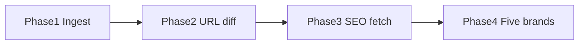
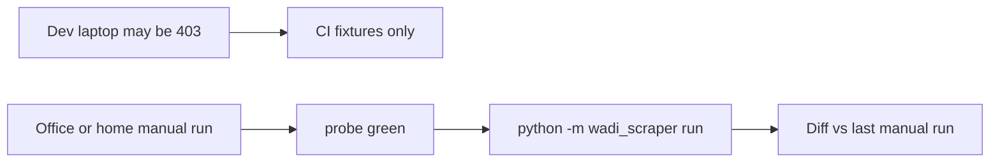

# Competitor sitemap tracker

Nike is the client and is not crawled. The end state tracks Reebok, Hoka, Adidas, Brooks, and Asics. **Build in four phases**; each phase has a runnable CLI outcome and its own tests before moving on.

## End-state behavior (after Phase 4)

Discover `Sitemap:` from `robots.txt`, allow-list non-product child sitemaps only, parse in memory (no sitemap files on disk). Store US content and collection URLs in **cloud Postgres** via `DATABASE_URL`. Diff vs the previous successful run. Fetch HTML in memory only (capped queue). Report URL and SEO changes with per-brand health.

Details on locale, lastmod, tiers, and agency limits are unchanged from earlier planning; phases **introduce** them in order below.

## Deployment requirement (required for usefulness)

**If sitemap requests return 403, the tool delivers no competitor insight for that brand.** Reporting `sitemap_error` is honesty for debugging, not a substitute for data.

**Chosen approach:** when you **manually** run `probe` and `run`, do it on a **residential or office network** (e.g. Mac at home, agency office machine)—the same kind of network a person uses in a browser—not from typical cloud CI, datacenter shells, or many VPNs. Reebok often works everywhere; Hoka, Adidas, Brooks, and Asics frequently block non-consumer IPs.

**No scheduled job in v1.** Runs are on-demand only (`python -m wadi_scraper run`). Diff is always vs the **previous successful manual run** in the **cloud database**. Gap between runs can be days or weeks; the report should note **days since last snapshot** so a long gap is not misread as a quiet market.

## Persistence (cloud DB — nothing competitor-related on disk)

**Your preference:** no catalog or snapshot **files** on the laptop. That works if history lives in **Postgres** (Neon, Supabase, RDS, etc.).

| Data | Where it lives |
|------|----------------|
| Sitemap XML, HTML bodies | **Not saved** — parsed in RAM during the run, then discarded |
| URL inventory, runs, SEO fields, report JSON | **Cloud Postgres** (`DATABASE_URL` in `.env`, not committed) |
| Markdown report | **Default:** stored in DB on the run row + printed to terminal; **optional** `--write-report ./path` if you want a file once |
| Product catalogs | **Never** requested or stored |

**What still happens on the machine that runs the CLI:** HTTP requests (same as using a browser, but automated), Python venv/deps, and your code repo. **No** local `data.db`, `reports/` folder by default, or downloaded XML.

**Tests:** CI uses a separate `TEST_DATABASE_URL` (disposable Postgres branch/schema) or migrations against an ephemeral DB—never the production Nike competitor data.

**Requirement:** you need network access to **both** the cloud DB and the competitor sites when you `run`. If `DATABASE_URL` is unreachable, the run fails before writing snapshots.

**Neon or Supabase (either is fine):** both are managed **PostgreSQL**. The app uses a standard `postgresql://…` URL and SQL migrations—no vendor-specific SDK required.

| | Neon | Supabase |
|---|------|----------|
| Connection | Project → Connection string → `DATABASE_URL` (use **pooled** URL for CLI if offered) | Project Settings → Database → URI (`?sslmode=require` often included) |
| SSL | Required (`sslmode=require` in URL) | Required |
| Test vs prod | **Branches** (e.g. `main` prod, `dev` for local/CI) fit this project well | Separate projects or schemas; second project for CI |
| Free tier | Usually enough for URL rows + reports (no blob storage) | Same |

Pick one provider for v1; switching later is only a new `DATABASE_URL` and running migrations on the new database.

**Before a manual run you trust for Nike:**

1. On the **same machine and network** you will use for `run`, execute `python -m wadi_scraper probe` (once per brand or all five).
2. Each enabled brand should show HTTP **200** on the configured index and at least one **allowed** child sitemap.
3. If a brand is 403, fix network (VPN off, office Wi‑Fi) or **disable that brand** in config—do not share a report that is mostly empty errors.

Development on a blocked network is fine: **CI uses fixtures** to prove code. **Value to Nike comes from manual runs on a host/network where `probe` is green.**

---

## Phase 1 — Sitemap ingest and baseline (Reebok only)

**Goal:** Prove discovery, allow/deny, and storage without change detection or HTML.

**Scope**

- Python 3.11 package: `httpx`, `lxml`, PyYAML, `psycopg` (or SQLAlchemy), pytest; schema via SQL migrations (e.g. `sql/` or Alembic).
- `.env.example` with `DATABASE_URL`; app refuses `run` if unset (except tests).
- [`config/competitors.yaml`](config/competitors.yaml): Nike as client; **Reebok fully configured**; other four brands present as stubs (name + host only) for later.
- Reebok rules: allow `sitemap_pages_`, `sitemap_blogs_`, `sitemap_collections_`; deny `sitemap_products_`, `sitemap_agentic_discovery`; host `www.reebok.com`; drop cart/search/filter junk locs; drop `/products/` locs if mixed into an allowed file.
- [`src/wadi_scraper/sitemap.py`](src/wadi_scraper/sitemap.py): robots discovery, index → allow-listed children, gzip, preserve Shopify query strings on child sitemap URLs.
- [`src/wadi_scraper/store.py`](src/wadi_scraper/store.py): Postgres tables `runs`, `url_observations` (url, page_type, lastmod, run_id, competitor).
- URL normalization v1: lowercase host, drop fragment, stable scheme (`https`), optional trailing-slash rule documented in config.
- CLI: `python -m wadi_scraper run --competitor reebok` writes a run row and URL counts to stdout (pages / blogs / collections / skipped sitemap links).

**Exit criteria**

- Live run against Reebok completes without requesting any `sitemap_products_*` URL (assert via test mock or logged request list).
- No XML or catalog files written under the project tree; rows only in Postgres.
- Second run on the same day replaces or versions snapshot for that competitor (same run id strategy documented: one snapshot per run, keyed by run timestamp).

**Tests (Phase 1 only):** fixture index + children; product child never fetched; unknown child skipped; locale/junk locs dropped.

**Not in Phase 1:** diff, reports, HTML fetch, other competitors.

---

## Phase 2 — URL inventory diff and reporting

**Goal:** Deliver **useful agency output without fetching pages** — what URLs appeared or disappeared, with honest failure states.

**Scope**

- [`src/wadi_scraper/diff.py`](src/wadi_scraper/diff.py): added / removed vs **previous successful run** for the same competitor; note gap days if last run failed or is old.
- Bulk **lastmod stamp** detection on stored inventory (report only in Phase 2; no HTML yet): `ignored N urls sharing lastmod T`.
- [`src/wadi_scraper/report.py`](src/wadi_scraper/report.py): build markdown + JSON; **persist on `runs.report_md` / `runs.report_json`**; print summary to stdout; optional `--write-report DIR`.
- **Per-competitor status:** `ok` | `sitemap_error` | `partial` — never show an empty “no changes” when the sitemap never loaded.
- Report sections: client Nike; per brand — status, skipped sitemap links, counts by page_type, **added URLs** (cap 100 + remainder), **removed URLs** (cap 100 + remainder), bulk lastmod note.
- CLI: `python -m wadi_scraper report` (latest or `--run-id`).
- First run remains **baseline**: do not emit full inventory as “added”; flag `baseline: true` in JSON.

**Exit criteria**

- Two fixture runs produce correct add/remove lists.
- Simulated sitemap 403 → status `sitemap_error`, no add/remove lists.
- Markdown readable by a non-engineer (status line at top of each competitor block).

**Tests:** baseline behavior, add/remove, bulk lastmod classification, blocked sitemap status.

**Not in Phase 2:** HTML, SEO fields, URL tiers, multi-competitor live run.

---

## Phase 3 — On-page SEO, tiers, and signal quality

**Goal:** Add **title / meta / H1 / canonical / robots** changes on a **small, prioritized** fetch batch.

**Scope**

- URL **tiers** (config + classifier):
  - **Tier A** — High signal: `sale`, `new-arrivals`, shallow collection slugs; all `/blogs/`; selected `/pages/` (promo, about, membership — not size guides / legal / cookie / privacy / opt-out).
  - **Tier B** — Other non-hash collections: URL diff in report; HTML only if new or selective lastmod.
  - **Tier C** — Hash-suffix merchandising collections (e.g. Reebok `…-0acz00a`): **count-only** in add/remove totals, excluded from default URL list and from fetch queue.
- [`src/wadi_scraper/extract.py`](src/wadi_scraper/extract.py): parse static HTML; store `final_url`, `canonical`, fields; normalize HTML entities before compare.
- Fetch queue: new Tier A/B URLs; selective lastmod (not bulk); rotating sample 10/run (Tier A/B, oldest fetch first). Hard cap **50** HTML requests per competitor; Tier A before Tier B.
- Postgres table `page_snapshots` (fields + fetched_at + http_status).
- Report: separate **URL inventory changes** vs **confirmed SEO field changes** (before/after); `fetched 50 of N`; low-confidence note when H1 empty but title present (likely JS).
- Reebok-only live validation documented in README.

**Exit criteria**

- Fixture run detects title/meta change on a Tier A URL.
- Cap 50 enforced; Tier C URLs never fetched.
- Bulk lastmod does not enqueue mass fetch; new Tier A URL still fetched.

**Tests:** tier classification, entity normalization, fetch cap order, rotating sample, SEO diff.

**Not in Phase 3:** full five-brand config tuning, CI against live network for all brands.

---

## Phase 4 — Five competitors and production harden

**Goal:** Each brand is **certified** on its own sitemap shape and filters—not by copying Reebok rules—then one `run` covers all five with independent pass/fail.

**Scope**

- **Brand profiles** in [`config/competitors.yaml`](config/competitors.yaml): `platform` hint (`shopify` | `sfcc` | `custom`), seeds, allow/deny sitemap regexes, US path rules, page-type path rules, tier patterns, and `html_mode: static | likely_js` (sets report confidence only; no headless in scope).
- **One profile per brand** (discovered before coding rules):
  - **Reebok** — Shopify index; allow pages/blogs/collections children; deny products (Phase 1 reference).
  - **Hoka** — SFCC; seed `sitemap_index_all.xml` only; deny hreflang static sitemaps; US loc filter on paths inside allowed children.
  - **Adidas** — Custom/glass; US `/us/` loc prefix; allow/deny child names verified via probe (not guessed from Reebok).
  - **Brooks** — US host; deny `/en-ca/` and other locale prefixes; category vs product child patterns from probe.
  - **Asics** — `/us/en-us/` prefix on locs; same probe-first workflow.
- CLI **`python -m wadi_scraper probe [--competitor NAME]`** (Phase 4 deliverable): for each brand, fetch `robots.txt` + configured index URL only; print status code, `Sitemap:` lines, which children would be **allowed / denied / skipped**, and **zero** downloads of product sitemaps. Used to tune YAML before a full `run`.
- **Per-brand fixture certification:** under `tests/fixtures/<brand>/`, minimal real-shaped XML (index + one allowed child snippet, sanitized locs). CI runs the same ingest pipeline as live for **all five** brands against fixtures—so logic is not Reebok-only even when live network blocks four brands.
- CLI: `python -m wadi_scraper run` (all enabled competitors) and `--competitor`; continue-on-error per brand.
- README: install, phases, **manual workflow** (`probe` → `run` → open report), office/home network guidance, brand/platform table. **No cron / launchd / GitHub Actions** for live crawls in v1.
- **Sign-off on the manual-run machine:** for each enabled brand, `probe` → index 200 + ≥1 allowed child; `run` → &gt;0 stored US URLs; product sitemap never in probe “would fetch” list. Brands that fail probe stay **disabled** until the network is changed.

**Exit criteria**

- CI pytest ingests fixtures for **all five** brands; product sitemap URLs never requested in any fixture test.
- Reebok rules are not hard-coded in Python; only YAML + shared engine.
- **Production exit (deployment host):** `probe` green for all **enabled** brands; one full `run` + report with at least URL counts per brand (not all `sitemap_error`).

**Explicit non-goal:** making 403 datacenter crawls succeed without changing run location (no proxy/headless in scope).

---

## Making it work for all brands (not just Reebok)

Reebok is the **reference implementation** (Shopify, static HTML, sitemap reachable from many networks). The other four differ in **sitemap layout**, **locale**, and **bot protection**. Use the same engine; **do not** reuse Reebok’s allow-list strings for other brands.

| Risk | Reebok | Other brands | Mitigation in plan |
|------|--------|--------------|-------------------|
| Sitemap index shape | Shopify `sitemap.xml` + named children | SFCC index, glass paths, locale indexes | Per-brand `allow_sitemap` / `deny_sitemap`; `probe` before `run` |
| Product catalog | Separate `sitemap_products_*` files | Often separate product XML or mixed locs | Deny product **files**; drop `/products/` locs when parsing allowed files |
| Locale noise | Single US host | hreflang sitemaps, `/us/`, `/en-us/` | Filter on child sitemap URL + on each `<loc>` |
| Live fetch blocked | Usually 200 | Often 403 from datacenter/VPN | **Run on office/home**; disable brand until `probe` passes on that host |
| SEO in HTML | Title/meta in first response | H1 often JS | `html_mode: likely_js`; low-confidence flag in report; URL diff still valuable |

**Engine vs profile:** Python implements one pipeline (discover → allow child → parse loc → normalize → filter → store). All brand-specific behavior lives in YAML (and optional small `platform` helpers only where unavoidable, e.g. Shopify query-string preservation). Adding a sixth competitor is **config + fixture + probe sign-off**, not a fork.

**Definition of “works” for a brand**

1. **Fixture path:** ingest test passes with realistic XML for that brand.
2. **Probe path (deployment host):** index HTTP 200 and ≥1 allowed child for each enabled brand.
3. **Run path (deployment host):** stores a plausible count of US content/collection URLs—not zero, not all errors.
4. **Safety path:** request log contains no denied product sitemap URL.

Phases 1–3 intentionally depth-first on Reebok so the engine is stable; Phase 4 is where **four additional brand profiles + five-way fixture CI + probe** prove the tool is multi-brand, not Reebok-only.

---

## Shared rules (all phases)

- **No product catalog download.** Product sitemap URLs are never HTTP-requested; product `<loc>`s are never stored.
- **No sitemap files on disk.** No `--sitemap-file` import.
- **Locale:** filter on sitemap child URL before download and on each `<loc>` (US rules per brand — see Phase 4 config).
- **Politeness:** one request at a time per host, delay, retries on 429/5xx, identifiable User-Agent.

## Stack and file map (built incrementally)

| Module | Phase |
|--------|-------|
| `config/competitors.yaml` | 1 (Reebok), 4 (all) |
| `sitemap.py` | 1 |
| `store.py` | 1, 3 (page snapshots) |
| `diff.py` | 2, 3 (fetch queue) |
| `report.py` | 2, 3 (SEO sections) |
| `extract.py` | 3 |
| `cli.py` | 1, 2, 4 |

## Agency limits (unchanged; honest in README from Phase 2)

No product SKUs, no ad-only LPs, no hero promo copy unless in title/meta/H1, no Nike mirror, no Slack. Blocked brands must read as **failed check**, not quiet competitors. A report that is mostly `sitemap_error` means **wrong deployment network**, not “competitors did nothing.”

## Out of scope (all phases)

Scheduled cron or cloud automation for live crawls, dashboard, headless browser, proxy/bot bypass, Nike crawl, Slack/email, weekly narrative generation. (Adding cron later is ops-only; history stays in Postgres.)
