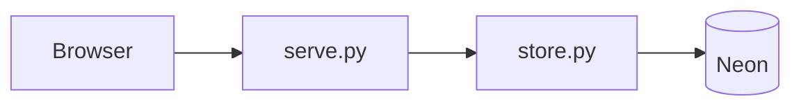
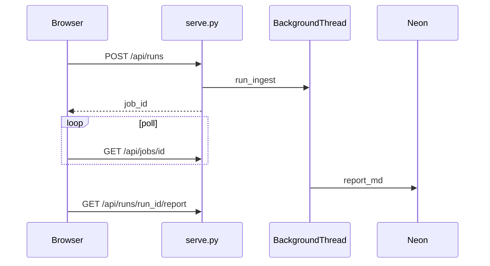

# Local report UI (Phase 1 + Phase 2)

## Phase 1 — Read-only report browser

**Goal:** Localhost dashboard to **browse** stored reports — no crawling from the browser yet.

- List runs from Neon; filter by competitor.
- Click a run → render **`report_md`** (same as `wadi_scraper report`).
- Competitor names from [`config/competitors.yaml`](config/competitors.yaml).

### Phase 1 API

| Method | Path | Purpose |
|--------|------|---------|
| GET | `/` | HTML shell |
| GET | `/api/competitors` | id, name, enabled |
| GET | `/api/runs?competitor=&limit=50` | Run history |
| GET | `/api/runs/{id}/report` | `{ markdown, run_id, competitor_id, status }` |

### Phase 1 UI

- Competitor filter + run table (date, status, page/blog/collection counts).
- Main pane: markdown rendered via **marked.js**; toggle raw.
- Status badge (`ok` / `partial` / `sitemap_error`).
- Footer note: “To refresh data, run `python -m wadi_scraper run` (Phase 2: Run button here).”

### Phase 1 deliverables

- [`list_runs`](src/wadi_scraper/store.py) in store.
- [`src/wadi_scraper/serve.py`](src/wadi_scraper/serve.py) — read routes only.
- [`ui/report_viewer.html`](ui/report_viewer.html).
- CLI: `python -m wadi_scraper serve` (default `127.0.0.1:8787`).
- Package `ui/` in [`pyproject.toml`](pyproject.toml); README section.
- Tests: read API handlers with mocked store (no job tests yet).

**Phase 1 exit:** `serve` + browser shows latest Reebok markdown from an existing run.

---

## Phase 2 — Interactive runs from UI

**Goal:** Start ingests from the UI (same pipeline as CLI), with async progress.

1. **Run** / **Run all enabled** buttons.
2. Background job + poll until done; refresh list and open new report.

### Phase 2 API (additions)

| Method | Path | Purpose |
|--------|------|---------|
| POST | `/api/runs` | `{ competitor_id }` or `{ all_enabled: true }` → `{ job_id }` |
| GET | `/api/jobs/{job_id}` | `{ status, run_ids[], lines[], error? }` |

Rules: one active job (409); disabled competitor → 400; reuse [`run_ingest`](src/wadi_scraper/runner.py) in job thread with own DB connection.

### Phase 2 UI (additions)

- **Run** / **Run all enabled** + progress panel (poll ~2s).
- On completion: refresh runs, select newest `run_id`.

### Phase 2 deliverables

- [`src/wadi_scraper/jobs.py`](src/wadi_scraper/jobs.py) (or module in serve) — thread-safe job registry.
- Extend serve + HTML.
- [`tests/test_serve_jobs.py`](tests/test_serve_jobs.py).

**Phase 2 exit:** Full ingest from UI for Reebok; job log shows status and new report loads automatically.

---

## Shared architecture

| Piece | Choice |
|-------|--------|
| Server | stdlib `ThreadingHTTPServer` + JSON |
| Bind | `127.0.0.1` default (README: do not expose without auth) |
| Config / env | [`load_env`](src/wadi_scraper/env.py), `DATABASE_URL` |

## Out of scope (both phases)

- Hosted deploy, auth, multi-user
- Probe / regenerate from UI (CLI)
- Structured JSON tabs (inventory/SEO tables) — markdown first

## Implementation order

**Phase 1 first** (ship usable viewer):

1. `list_runs` + tests  
2. `serve.py` read-only + `cli serve`  
3. `ui/report_viewer.html`  
4. Packaging + README  

**Then Phase 2:**

5. `jobs.py` + POST/GET job routes  
6. UI buttons + polling  
7. Job tests + README update  
